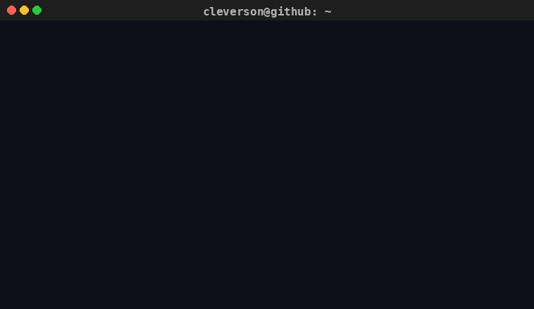
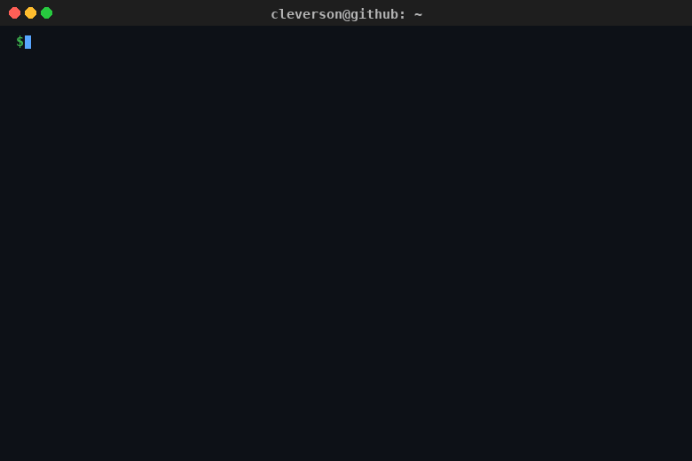
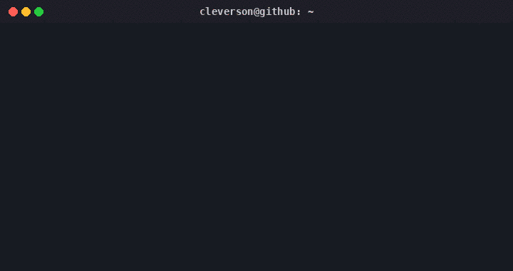
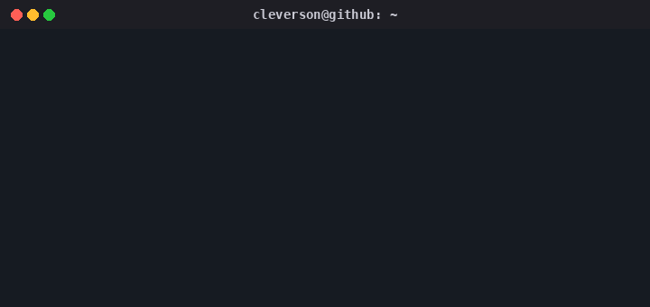

 

---

## `> whoami`

> I build software focused on **backend engineering, system integration, APIs, automation and AI-powered solutions**.

---

## `> ./about-me.sh`

---

## `> tech-stack --list`

### `LANGUAGES`

### `BACKEND`

### `FRONTEND`

### `DATABASE`

### `CLOUD & DEVOPS`

---

## `> architecture --principles`

---

## `> github --stats`

 

---

## `> contributions`

---

## `> currently-learning`

---

## `> connect`

---

